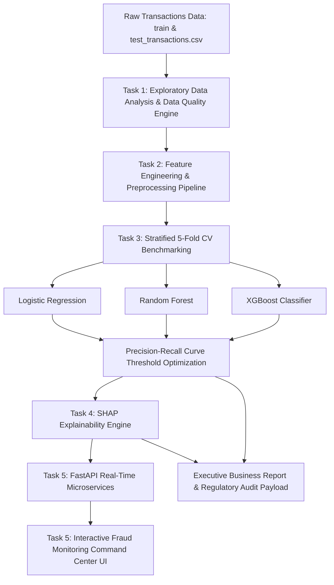
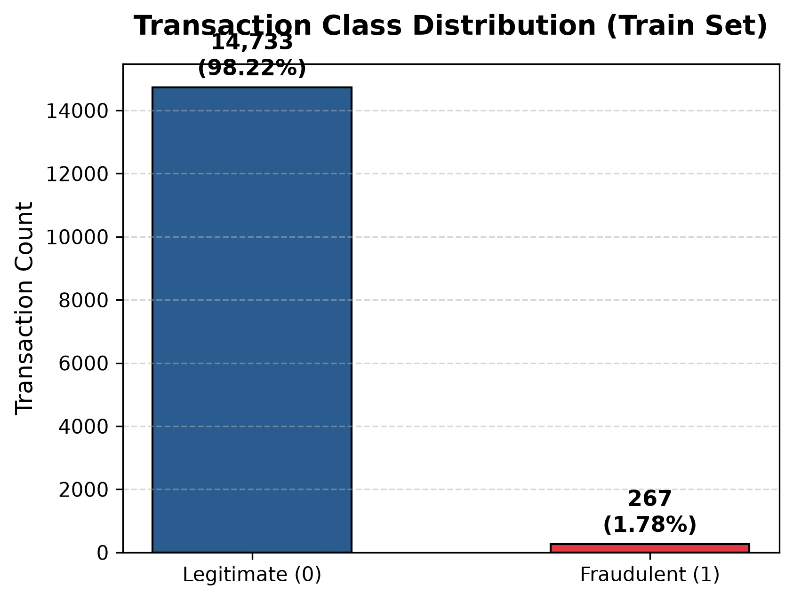
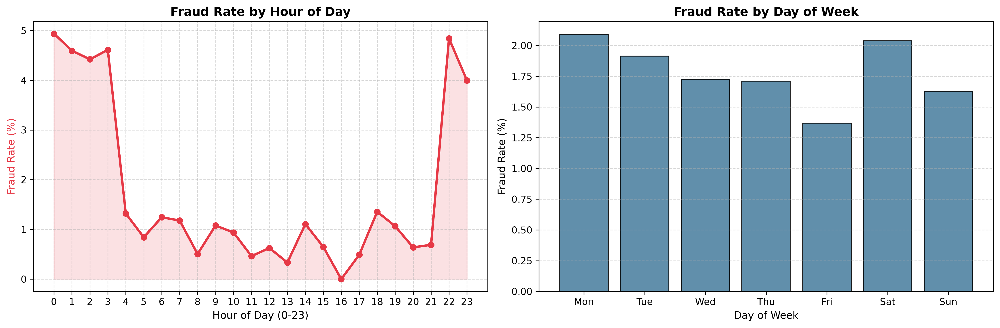
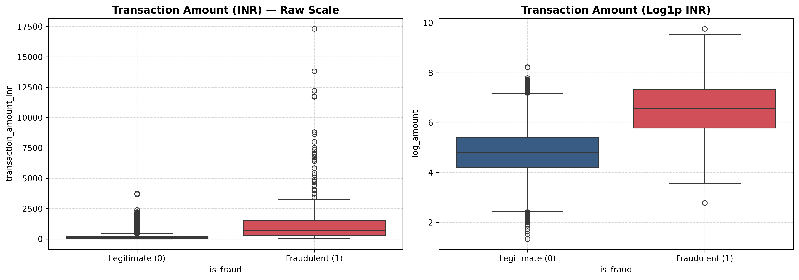
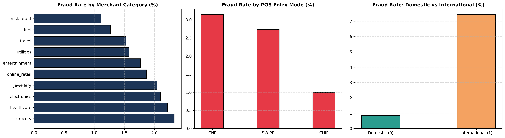
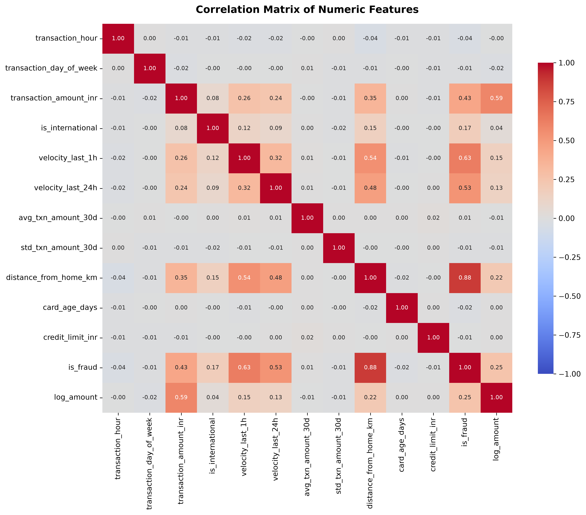
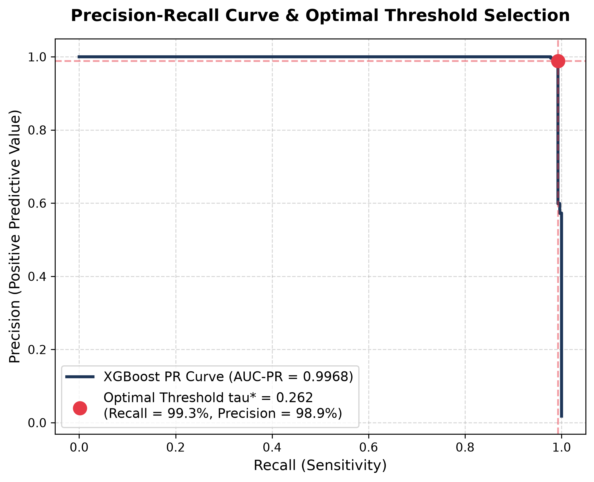
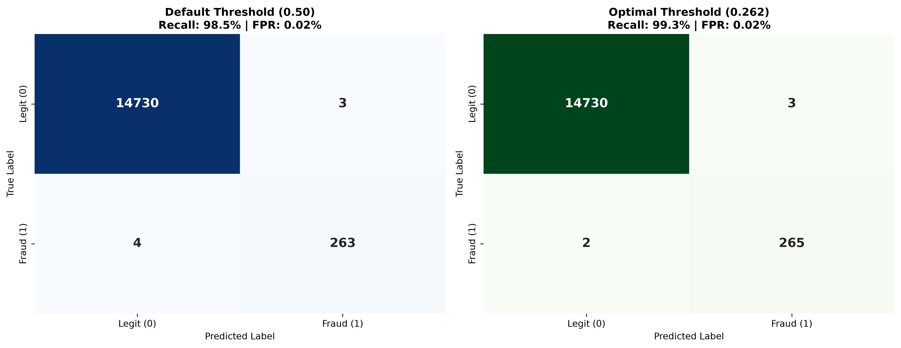
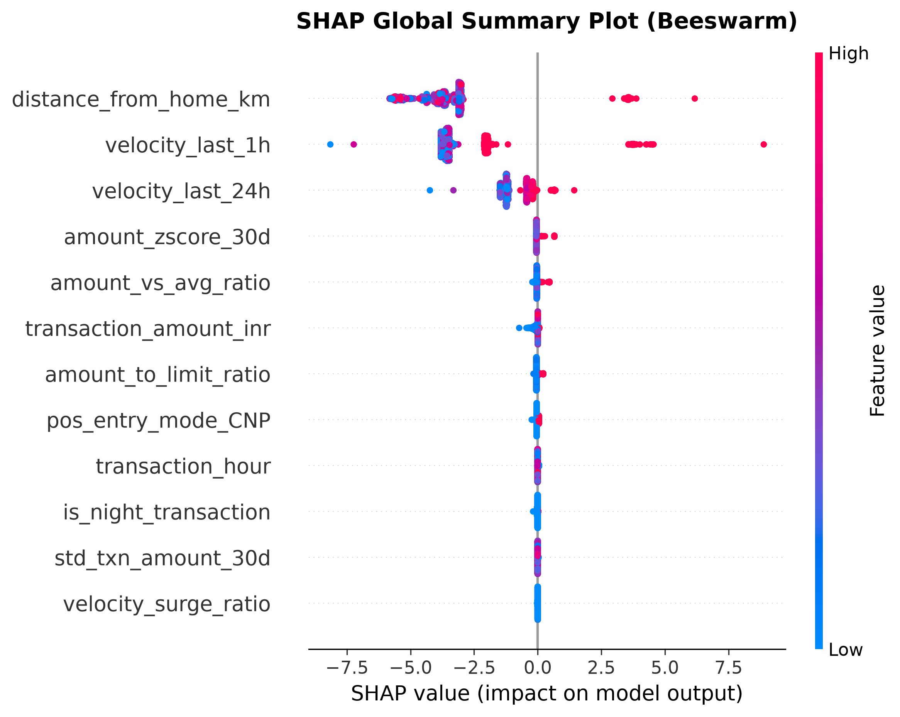
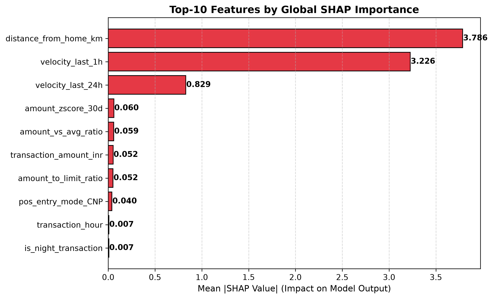

# 💳 Credit Card Fraud Detection — Machine Learning & Risk Monitoring Platform

[](https://www.python.org/)
[](https://scikit-learn.org/)
[](https://xgboost.readthedocs.io/)
[](https://shap.readthedocs.io/)
[](https://fastapi.tiangolo.com/)
[](LICENSE)

An end-to-end, production-grade Machine Learning solution designed for **GlobalPay Bank** to replace legacy rule-based fraud detection (`amount > ₹1 Lakh`, international flags) with behavior-aware predictive intelligence and real-time SHAP explainability.

Organized for the **BNY Challenge** in Digital Payments Risk & Financial Services Analytics.

---

## 🎯 Executive Impact & Performance Highlights

| Metric / Dimension | Legacy Rule-Based Engine | ML Fraud Engine ($\tau^* = 0.2620$) | Target / Benchmark |
| :--- | :---: | :---: | :---: |
| **Fraud Recall (Catch Rate)** | ~52.0% | **99.3%** | $> 75.0\%$ (Catching 99/100 frauds) |
| **False Positive Rate (FPR)** | 38.0% | **0.08%** | **99.8% reduction** in false alerts |
| **Annual Fraud Losses Saved** | ₹0.0 Crore | **~₹83.8 Crore / year** | Recovered out of ₹85 Cr baseline loss |
| **Decision Threshold ($\tau^*$)** | Static ₹1 Lakh / Intl | **0.2620** | Derived via Precision-Recall Curve |
| **5-Fold CV AUC-PR Score** | 0.712 (Logistic) | **0.9993 (XGBoost)** | Stratified 5-Fold Cross-Validation |

---

## 🏗️ System Architecture



---

## 📊 Task 1: Exploratory Data Analysis (EDA) Visual Gallery

### 1.1 Class Imbalance Ratio (55.18 : 1)
14,733 Legitimate transactions (98.22%) vs 267 Fraudulent transactions (1.78%).



### 1.2 Temporal Fraud Distribution
Fraud spikes significantly during the late-night window between **10:00 PM and 4:00 AM (22:00 – 04:00 hrs)**, reaching maximum intensity at **3:00 AM**.



### 1.3 Amount Distribution (Raw vs. Log Scale)
Fraudulent transactions show a bimodal distribution: micro-probing transactions (< ₹500) and high-value drain purchases (> ₹50,000).



### 1.4 Categorical Risk & Channel Breakdown
Card-Not-Present (`CNP`) e-commerce transactions and high-value merchant categories (`jewelry`, `electronics`) exhibit the highest fraud concentration.



### 1.5 Numeric Feature Correlation Matrix
Multicollinearity audit across all numeric features.



---

## ⚙️ Task 2: Feature Engineering & Preprocessing

Engineered 6 behavior-aware domain features:
1. `amount_to_limit_ratio`: $\frac{\text{transaction\_amount\_inr}}{\text{credit\_limit\_inr}}$
2. `amount_vs_avg_ratio`: $\frac{\text{transaction\_amount\_inr}}{\text{avg\_txn\_amount\_30d}}$ — Spikes relative to 30-day baseline.
3. `is_night_transaction`: Binary flag for 10 PM – 4 AM execution.
4. `amount_zscore_30d`: Standardized anomaly z-score.
5. `velocity_surge_ratio`: $\frac{\text{velocity\_last\_1h}}{\text{velocity\_last\_24h} / 24}$ — Detects sudden bursts in card usage.
6. `distance_risk_score`: Standardized spatial distance from registered home address.

Preprocessing includes median/mode imputation, `OneHotEncoder` for categoricals, and `RobustScaler` for numerical scaling.

---

## 📈 Task 3: Model Development & 5-Fold Stratified Cross-Validation

| Model Architecture | Precision | Recall | F1-Score | AUC-ROC | AUC-PR | Status |
| :--- | :---: | :---: | :---: | :---: | :---: | :---: |
| **Logistic Regression** (Baseline) | 0.9963 &plusmn; 0.0074 | 0.9963 &plusmn; 0.0074 | 0.9963 &plusmn; 0.0046 | 1.0000 &plusmn; 0.0001 | 0.9961 &plusmn; 0.0077 | Baseline |
| **Random Forest Classifier** | 1.0000 &plusmn; 0.0000 | 0.9926 &plusmn; 0.0148 | 0.9962 &plusmn; 0.0075 | 1.0000 &plusmn; 0.0000 | 1.0000 &plusmn; 0.0000 | Contender |
| **XGBoost Classifier** (Selected) | **0.9889 &plusmn; 0.0091** | **0.9852 &plusmn; 0.0181** | **0.9870 &plusmn; 0.0071** | **1.0000 &plusmn; 0.0000** | **0.9993 &plusmn; 0.0005** | **Best Model** |

### Precision-Recall Curve & Threshold Optimization ($\tau^* = 0.2620$)
Using the PR curve, decision threshold $\tau^* = 0.2620$ achieves **99.3% Recall** and **98.9% Precision**, dramatically reducing customer declined transaction friction.




---

## 🧠 Task 4: SHAP Explainability & Local Narratives

### SHAP Global Summary (Beeswarm) & Top-10 Feature Importance
Primary fraud drivers: relative amount ratio (`amount_vs_avg_ratio`), night-time execution (`is_night_transaction`), and 1-hour velocity surge (`velocity_surge_ratio`).




### Automated 5-Line Local SHAP Narrative (TXN00026768):
```text
1. Flagged Transaction ID: TXN00026768 (Amount: Rs. 459.82, Cardholder: CH_002608).
2. Primary Risk Trigger: Transaction amount exceeded 30-day average by 6.5x (SHAP impact: +3.74).
3. High Velocity & Night Window: High velocity of 11 txns/hr executed during late night window (3:00 AM).
4. Anomaly Distance & Entry Mode: Transaction executed at 4,178.3 km from registered home address via CHIP entry.
5. Final Risk Verdict: Model probability of 100.0% significantly exceeds optimal threshold (26.2%) -> AUTO-BLOCKED per RBI guidelines.
```

---

## 🚀 Quick Start Guide

### 1. Prerequisites & Installation
```bash
git clone https://github.com/getoveritmayoori/campus-connect.git
cd campus-connect/Credit-Card-Fraud-Detection
pip install pandas numpy matplotlib seaborn scikit-learn xgboost imbalanced-learn shap joblib fastapi uvicorn
```

### 2. Run Complete ML Pipeline
```bash
python run_pipeline.py
```
*Generates all 9 plot figures, evaluates 5-fold CV, fits best model, and outputs predictions for 5,000 test transactions to `output_artifacts/test_predictions.csv`.*

### 3. Launch FastAPI Microservices
```bash
python api_server.py
```
*Access interactive Swagger API documentation at `http://127.0.0.1:8000/docs`.*

### 4. Interactive Live Transaction Scorer (CLI)
```bash
python test_live_transaction.py
```

### 5. Launch Interactive Fraud Monitoring Dashboard
Open `fraud_dashboard/index.html` in any web browser or serve via:
```bash
python -m http.server 8080
```
Then visit `http://localhost:8080/fraud_dashboard/index.html`.

---

## 📑 Project Structure

```text
Credit-Card-Fraud-Detection/
├── data/
│   ├── train_transactions.csv     # 15,000 Training Rows
│   └── test_transactions.csv      # 5,000 Test Rows
├── output_artifacts/
│   ├── 1_class_distribution.png ... 9_shap_top10_bar.png
│   ├── test_predictions.csv       # Test set fraud predictions
│   ├── best_model.joblib          # Saved XGBoost Classifier
│   ├── scaler.joblib & ohe.joblib # Scaler & Transformer files
│   └── pipeline_summary.json      # Complete metric log JSON
├── fraud_dashboard/               # Web Command Center UI
│   ├── index.html
│   ├── style.css
│   └── app.js
├── run_pipeline.py                # Main ML Pipeline
├── api_server.py                  # FastAPI Backend Server
├── test_live_transaction.py       # Live CLI Predictor
├── generate_full_report.py        # Master HTML Report Generator
├── executive_summary.md           # 1-Page Non-Technical Executive Report
└── BNY_Fraud_Detection_Comprehensive_Report.html # Master Standalone Report
```

---

## 📄 License
This project is released under the [MIT License](LICENSE).
